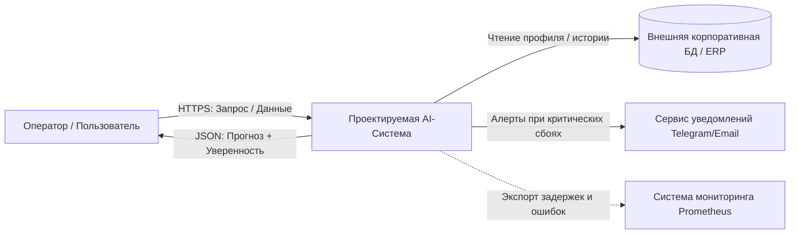

# Лабораторная работа №2 Проектирование архитектуры программной системы искусственного интеллекта
#### Работу выполнили студенты группы ЕТ-312
#### Шукшин Егор, Шевяков Александр
#### Тема № 8 — Персонализированная рекомендательная система (E-Commerce Recommender)

# Постанока задачи
### Бизнес-цель
Повысить конверсию и средний чек e-commerce платформы за счёт автоматической персонализированной выдачи релевантных товаров каждому пользователю в реальном времени, обеспечив при этом быстрый отклик (ANN-поиск + бустинг-ранжирование) и эффективное использование всего каталога, включая «длинный хвост».

### Конечный потребитель
Клиент платформы (B2C-покупатель), а также оператор/маркетолог через панель управления и внешние учётные системы (ERP/PIM/CRM) через API-интеграцию.

### Метрики эффективности:

 **Метрики бизнес-процесса:** рост конверсии из показа рекомендаций в покупку ( с 1.2% до 2.0%); увеличение доли GMV из рекомендаций ( с 12% до 25% от общей выручки); рост среднего чека заказов с рекомендованными товарами ( +10%); повышение retention D30 ( с 22% до 28%); рост CTR рекомендательного блока ( с 4% до 8%).

**Технические метрики (SLA):** время ответа сервиса (p95 < 200 мс); -пропускная способность (RPS ≥ 500); доступность (99.9%); доля ошибок 5xx (< 0.1%); свежесть эмбеддингов каталога (< 24 ч).

**Метрики качества модели:** Recall@100 ≥ 0.85; NDCG@10 ≥ 0.45; ROC-AUC (pCTR) ≥ 0.80; ROC-AUC (pCVR) ≥ 0.78; GAUC ≥ 0.65; калибровка ECE ≤ 0.05.

### Границы системы:

**Входит в систему:** валидация данных, генерация эмбеддингов каталога, инференс (ANN-поиск + бустинг-ранжирование), логирование, API, локальное хранение метаданных.

**Не входит в систему:** оформление и оплата заказа, управление складскими остатками и логистика, ценообразование и промо-движок, бухгалтерский и налоговый учёт, клиентская поддержка и возвраты, юридическое согласование документов.

**Таблица требований**
| Тип требования | Формулировка требования | Критерий приёмки |
|---|---|---|
| **Функциональное (FR-01)** | Генерация персональных рекомендаций для пользователя | Эндпоинт POST /api/v1/recommend принимает user_id и top_k и возвращает ранжированный список товаров с оценками релевантности |
| **Функциональное (FR-02)** | Двухстадийное ранжирование: генерация кандидатов + переранжирование | Из каталога отбирается ≥ 100 кандидатов через ANN-поиск по эмбеддингам, затем бустинг формирует финальный топ-N |
| **Функциональное (FR-03)** | Обработка «холодного старта» и fallback | При отсутствии истории пользователя или пустом результате модели выдаётся топ популярных товаров с флагом fallback_used = true |
| **Нефункциональное (NFR-01)** | Производительность онлайн-инференса | Время ответа сервиса p95 ≤ 200 мс, включая ANN-поиск (p95 ≤ 50 мс) и бустинг-ранжирование (p95 ≤ 80 мс) |
| **Нефункциональное (NFR-02)** | Масштабируемость и свежесть данных | Система выдерживает каталог ≥ 1 млн SKU и RPS ≥ 500; эмбеддинги обновляются не реже 1 раза в 24 ч, онлайн-признаки — не реже 1 раза в 5 мин |
| **Нефункциональное (NFR-03)** | Наблюдаемость и воспроизводимость выдачи | Каждый ответ содержит rec_id, model_version, timestamp, latency_ms; все показы и клики логируются для A/B-тестов и переобучения |

---
Диаграмма отображает интеграцию рекомендательной системы как центрального компонента с пользователями и окружением.



### Описание информационных потоков
1.  **Покупатель <-> System:** Протокол HTTPS (REST API). Частота: при каждом открытии карточки товара или главной страницы (примерно 50-200 запросов в секунду). Формат: JSON (ID сессии, ID текущего товара -> массив ID рекомендовых товаров с весами).
2.  **System -> CorpDB:** Протокол gRPC / SQL connection. Частота: On-demand (кэширование в Redis внутри системы для снижения нагрузки). Формат: структурированные профили пользователей и история покупок.
3.  **System -> AlertSystem:** Протокол HTTPS (Webhooks API). Частота: асинхронно, только при возникновении критических ошибок (5xx) или падении бизнес-метрик. Формат: JSON-текст алерта.
4.  **System -> Monitoring:** Протокол HTTP (Pull-модель Prometheus). Частота: каждые 15 секунд. Формат: OpenMetrics (plain text).

---

```mermaid
flowchart TB
    Client[Внешний клиент / Web-интерфейс] -->|HTTP POST /api/v1/predict| API[FastAPI Gateway]

    subgraph AppContainer [Контейнер приложения (FastAPI Service)]
        API --> Auth[Модуль аутентификации API-Key]
        Auth --> Validator[Pydantic Request Validator]
        Validator --> Preprocessing[Feature Preprocessing Pipeline]
        Preprocessing --> InferenceEngine[Model Inference Engine]
        
        InferenceEngine --> BusinessLogic[Прикладные бизнес-правила]
    end

    subgraph ArtifactStore [Хранилище моделей]
        InferenceEngine -.->|Загрузка весов v1.0.0| ModelFile[(Model Storage / MLflow / S3)]
    end

    subgraph DataStore [Слой персистентности]
        BusinessLogic -->|Запись факта прогноза и метаданных| AppDB[(PostgreSQL / SQLite)]
    end

    subgraph ObservabilityStack [Контур мониторинга]
        API -.->|Сбор метрик HTTP / Latency| MetricsEndpoint[/metrics Endpoint/]
        BusinessLogic -.->|Структурированные логи| LogsOutput[JSON Logger]
    end

    BusinessLogic -->|HTTP 200: JSON Response| Client
```

|   |   |   |   |   |
|---|---|---|---|---|
|Компонент|Назначение модуля|Входные данные|Выходные данные|Используемые библиотеки|
|app.api.routes|Обработка HTTP-запросов|HTTP Request|HTTP Response|fastapi, starlette|
|app.api.schemas|Pydantic-схемы валидации|JSON Raw Payload|Строго типизированный объект|pydantic|
|app.ml.preprocessing|Трансформация признаков|Словарь признаков|NumPy array / Tensor|numpy, scikit-learn|
|app.ml.inference|Исполнение инференса модели|Подготовленные фичи|Числовое предсказание, вероятности|onnxruntime, torch, joblib|
|app.services.prediction|Оркестрация бизнес-правил|Сырой запрос, вердикт модели|Готовый бизнес-результат|Чистый Python|
|app.repositories|Персистентность фактов прогноза|Сущность прогноза|Запись в БД|sqlalchemy, aiosqlite|

---

**Заголовки:** `Content-Type: application/json`, `X-API-Key: <secret_token>`

**Pydantic-схема входных данных:**
```python
from pydantic import BaseModel, Field
from typing import List, Optional

class PredictionRequest(BaseModel):
    item_id: str = Field(description="Уникальный идентификатор текущего просматриваемого товара")
    user_id: str = Field(description="Уникальный идентификатор пользователя")
    device_type: str = Field(default="desktop", description="Тип устройства (desktop, mobile, app)")
    current_cart_items: List[str] = Field(default=[], description="Список ID товаров, уже находящихся в корзине")

    class Config:
        json_schema_extra = {
            "example": {
                "item_id": "PROD_9982",
                "user_id": "USR_USER_4242",
                "device_type": "mobile",
                "current_cart_items": ["PROD_1122", "PROD_5544"]
            }
        }
```

**Pydantic-схема успешного ответа (200 OK):**
```python
from pydantic import BaseModel, Field
from typing import List

class RecommendedItem(BaseModel):
    item_id: str = Field(description="Идентификатор рекомендуемого товара")
    score: float = Field(ge=0.0, le=1.0, description="Скор уверенности/релевантности модели")

class PredictionResponse(BaseModel):
    request_id: str = Field(description="Уникальный идентификатор запроса (UUIDv4) для сквозного аудита")
    user_id: str = Field(description="Идентификатор пользователя")
    recommendations: List[RecommendedItem] = Field(description="Ранжированный список рекомендаций")
    model_version: str = Field(description="Семантическая версия используемой модели")
    manual_review_required: bool = Field(description="Флаг деградации/необходимости ручной проверки (для совместимости)")
```

**Пример тела успешного ответа:**
```json
{
  "request_id": "9b1deb4d-3b7d-4bad-9bdd-2b0d7b3dcb6d",
  "user_id": "USR_USER_4242",
  "recommendations": [
    { "item_id": "PROD_8877", "score": 0.94 },
    { "item_id": "PROD_0011", "score": 0.81 },
    { "item_id": "PROD_3344", "score": 0.76 }
  ],
  "model_version": "1.0.0",
  "manual_review_required": false
}
```

**Спецификация ошибок валидации (400 / 422 Bad Request):**
```json
{
  "error": "VALIDATION_FAILED",
  "detail": [
    {
      "field": "user_id",
      "message": "Field cannot be empty"
    }
  ]
}
```

### Системные эндпоинты

`GET /health` — проверка состояния сервиса и готовности модели:
    ```json
    {
      "status": "healthy",
      "model_loaded": true,
      "model_version": "1.0.0",
      "uptime_seconds": 3600
    }
    ```
`GET /metrics` — выдача технических и кастомных метрик для Prometheus в формате OpenMetrics.

---
